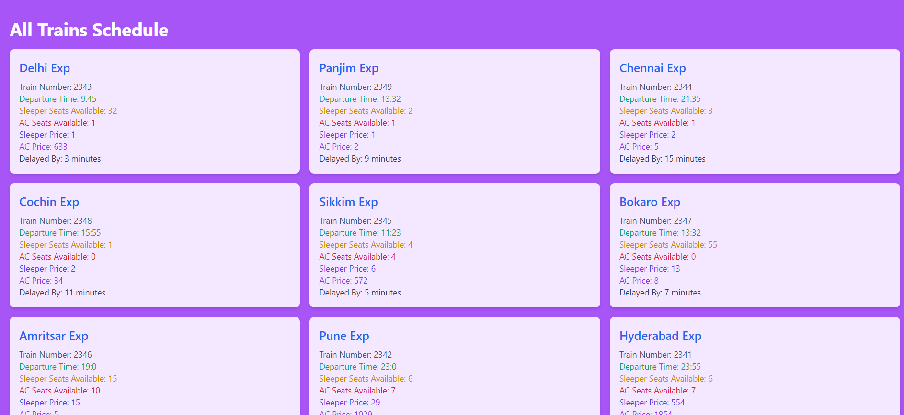

# Train Schedule App

The Train Schedule App is a web application that displays the schedule of trains along with their availability and prices. It allows users to view all available trains and their details in a sorted order based on custom sorting criteria.

## Features

- View all available trains with their details.
- Sort the trains based on custom sorting logic.
- Display train availability and prices for sleeper and AC classes.
- Display departure time and delay information.

## Technologies Used

The Train Schedule App is built using the following technologies:

- React: A JavaScript library for building user interfaces.
- Axios: A promise-based HTTP client for making API requests.
- Tailwind CSS: A utility-first CSS framework for styling the application.

## How to Run the App Locally

To run the Train Schedule App locally, follow these steps:

1. Clone the repository to your local machine:

```bash
git clone https://github.com/yashyvs/2000330100264.git
```
2. Change into the project directory:
```bash
cd app2
```
3. Install the dependencies using npm or yarn:
```bash
npm install
# or
yarn install
```
4. Start the development server:
```bash
npm start
# or
yarn start
```
Open your web browser and visit http://localhost:3000 to see the Train Schedule App in action.

## API Authentication
The Train Schedule App requires authentication to fetch train data from the API. The app uses a login mechanism to obtain an access token, which is then used to make authenticated API requests. The access token is generated when the app is first launched and is stored in the browser's local storage for subsequent use.

Please note that storing sensitive data like the client secret on the client-side is not recommended for production applications. This implementation is only suitable for demonstration purposes.

## Custom Sorting Logic
The app implements a custom sorting logic to sort the train data. By default, the data is sorted based on the price of the sleeper class in ascending order. The sorting logic can be adjusted as needed by modifying the customSort function in the TrainDataComponent.

